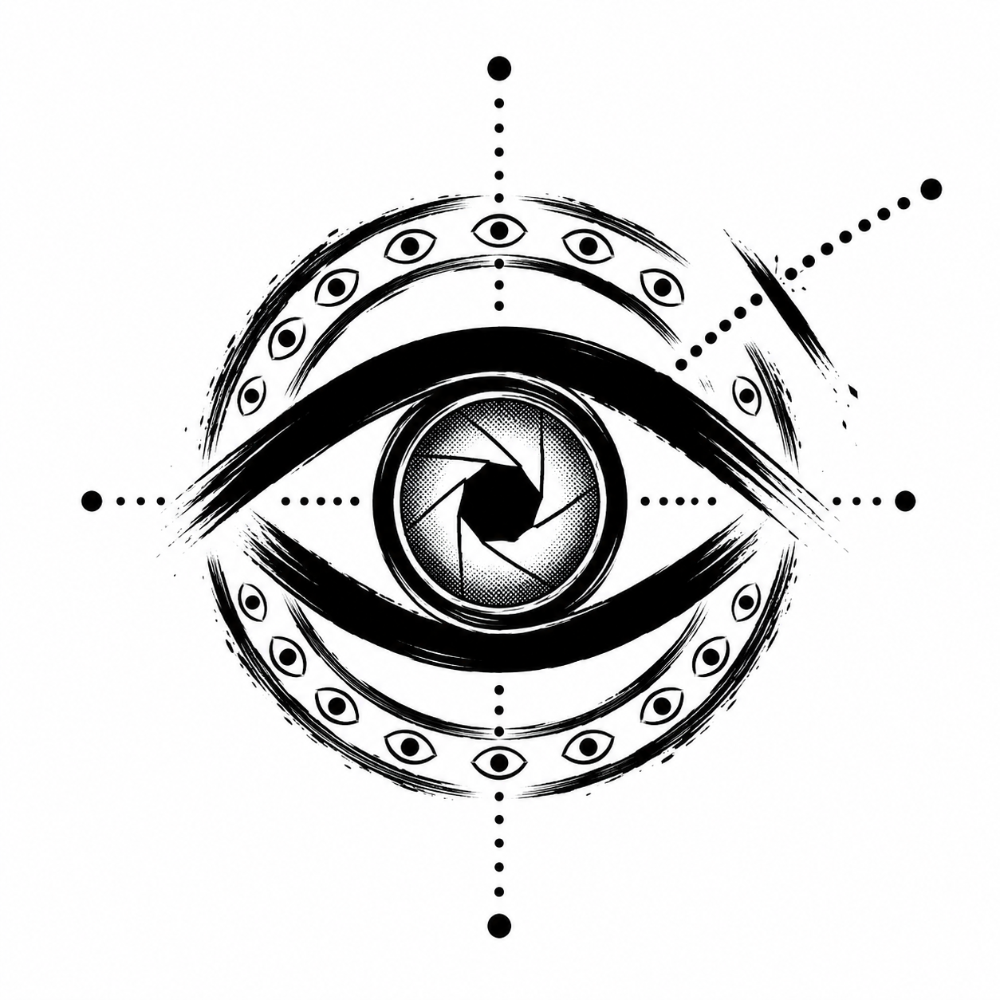

<p align="center">
  
</p>

<h1 align="center">ARGUS</h1>
<p align="center"><em>Middleware de surveillance comportementale pour agents IA</em></p>

<p align="center">
  <a href="https://github.com/zmak5/project-argus/actions/workflows/ci.yml"></a>
  <a href="https://github.com/zmak5/project-argus/actions/workflows/securite.yml"></a>
</p>

Détection d'injection de prompt indirecte par **analyse de trajectoire** : Argus
verrouille l'intention déclarée par l'utilisateur en début de session
(l'*empreinte d'intention*), puis inspecte chaque appel d'outil de l'agent pour
vérifier que la trajectoire reste cohérente avec cette intention.

Projet académique BIT — Génie Informatique L2 — Sawadogo Azael & Kader.
Références : [CdC v1.0](Argus_CdC_v1.0.docx) · [Étude préalable & état de l'art](docs/ETAT_DE_LART.md)

## Installation

```bash
pip install -r requirements.txt
cp .env.example .env        # puis renseigner GROQ_API_KEY (console.groq.com/keys)
```

Sans clé API, Argus fonctionne en **mode dégradé hors ligne** : couches 0 et 1
uniquement — suffisant pour les tests et le smoke test.

```bash
python -m pytest tests/ -q     # suite de tests (20 tests, 100 % hors ligne)
python -m interface.demo       # démo interactive : tapez votre requête, voyez Argus en action
```

## Architecture du moteur (normalisation + 3 couches + décision)

| Couche | Fichier | Rôle | Réseau |
|---|---|---|---|
| **Capture d'intention** | `middleware/intent_capture.py` | Extrait et verrouille l'empreinte (action, destinataires, périmètre) en début de session | Groq (fallback heuristique hors ligne) |
| **Prétraitement — Dé-obfuscation** | `middleware/text_normalizer.py` | Neutralise les évasions (caractères invisibles, homoglyphes cyrillique/grec, tags Unicode, pleine largeur, espacement lettre-à-lettre) avant analyse, et signale l'obfuscation comme suspecte | Non |
| **Couche 0 — Garde d'empreinte** | `middleware/fingerprint_guard.py` | Comparaison **déterministe** de chaque appel d'outil à l'empreinte (destination inconnue, action hors intention). Signal dominant. | Non |
| **Couche 1 — Règles** | `middleware/rules_engine.py` + `rules.json` | 13 patterns regex éditables sans code (EF-10), incluant l'exfiltration par image/URL markdown | Non |
| **Couche 2 — Juge LLM** | `middleware/coherence_checker.py` | Cohérence intention/action via Groq (`llama-3.1-8b-instant`), prompt durci anti-injection, **résultats mémoïsés** (cache LRU). Signal d'appoint, plafonné à 40 pts. | Groq |
| **Décision** | `middleware/argus.py` | Combine : `score = max(couche0, couche1 + couche2)` → `<30` AUTORISER · `30–70` CONFIRMER · `>70` BLOQUER. Latence mesurée (`duree_ms`). Journal JSONL. | — |

**Efficacité (benchmark hors ligne, `python -m tests.benchmark`)** : 100 % de
détection sur les documents piégés (dont un document obfusqué homoglyphes +
caractères invisibles), 0 % de faux positifs sur les documents sains, latence
couche 1 ~5 ms (seuil CdC : 3 s). Sans la dé-obfuscation, le document piégé
obfusqué passait totalement à travers la couche 1.

> Pourquoi la couche 0 domine : TrajAD (arXiv 2602.06443) montre que les
> LLM-judges zero-shot sont faillibles sur les anomalies de trajectoire — les
> vérifications déterministes portent donc le signal fort (détails :
> [docs/ETAT_DE_LART.md](docs/ETAT_DE_LART.md) §5).

## Contrat d'intégration (pour l'agent et l'interface)

```python
from middleware.argus import Argus

argus = Argus(protege=True)                      # bascule protégé/non protégé (EF-7)
argus.demarrer_session(requete_utilisateur)      # capture l'empreinte — OBLIGATOIRE

# Avant CHAQUE appel d'outil (aucun outil sensible sans passer par là — CdC §4.1) :
decision = argus.inspecter_appel_outil("send_message", {"destinataire": ..., "contenu": ...})
decision.niveau        # "AUTORISER" | "CONFIRMER" | "BLOQUER"
decision.score_global  # 0-100
decision.score_couche0 / .score_couche1 / .score_couche2   # pour l'affichage par couche
decision.motifs        # explications lisibles (EF-9)

# Optionnel, à l'arrivée d'un contenu externe (sortie de search_document) :
argus.analyser_contenu_externe(contenu, source="doc_rh_piege.txt")
```

Chaque événement (session, appel d'outil, contenu externe) est journalisé dans
`logs/decisions.jsonl` avec horodatage, scores et motifs (EF-6) — l'interface
peut lire ce fichier pour l'affichage en direct.

## Répartition du binôme

- **Sawadogo Azael — moteur** : tout `middleware/` + `tests/` + documents de test. ✅ Opérationnel.
- **ZARANI Kader — agent & interface** : `agent/agent.py` (boucle ReAct Groq avec tool
  use, gestion d'erreurs API et limite d'itérations) et `interface/demo.py`
  (CLI interactive avec bascule protégé/non protégé). ✅ Opérationnel — testé
  en conditions réelles sur les 4 documents piégés (exfiltration, divulgation
  de prompt système, obfuscation homoglyphes, faux positif contrôlé).

## Structure

```
argus/
├── agent/            # boucle ReAct + outils simulés (coéquipier)
├── middleware/       # le cœur : Argus (Kader)
├── data/             # 3 docs sains + 3 docs piégés (scénarios A/B/C)
├── interface/        # démo CLI/web (coéquipier)
├── tests/            # 20 tests hors ligne
├── logs/             # decisions.jsonl (généré, non versionné)
└── docs/             # étude préalable & état de l'art
```

## Modèles (corrigé vs CdC)

Mixtral-8x7B n'est plus servi par Groq. Utiliser :
- Agent : `llama-3.3-70b-versatile` — Juge : `llama-3.1-8b-instant`
- `temperature=0` partout (reproductibilité, CdC §7.2). Tier gratuit : ~30 req/min.
